# 🚲 共享单车管理系统

# 获取方式---本文件是项目的部分文件，有需要可看【煮页】

# 联系🐧: 3660038549（毕业设计-论文）

<br>

如需部署，请按“前台启动方式”和“后台启动方式”完成数据库导入、配置修改、项目启动和 Nginx 代理配置。

🚲 场景聚焦：面向共享单车租赁与运营管理业务，覆盖用户注册登录、站点查询、扫码用车、还车计费、订单查询、故障报修等完整流程。

🔐 角色权限：系统内置管理员和普通用户两类角色，不同角色登录后进入对应界面并拥有独立功能菜单。

🧾 用车闭环：用户可扫码开锁、生成用车订单、完成还车计费、查询历史订单，后台可查看订单状态并进行运营管理。

🚉 站点车辆：后台支持站点信息维护、车辆投放管理、车辆状态维护、二维码生成，便于管理车辆分布和使用情况。

🛠️ 故障报修：用户可提交单车故障报修并上传图片，管理员可查看、处理和维护报修状态。

📊 数据统计：后台提供用户数量、单车数量、订单数量、收入统计、车辆状态分布等运营数据展示，辅助管理决策。

#### 安装环境

JAVA 环境：JDK 1.8

Node.js 环境：建议 Node.js 18 或 Node.js 20

Maven 环境：建议 Maven 3.6+

MySQL 数据库：建议 MySQL 5.7 或 MySQL 8.0，请提前记住数据库账号和密码

IDEA 编译器：推荐使用 IntelliJ IDEA 导入后端项目

前端开发工具：推荐使用 VS Code 或 WebStorm

浏览器：Chrome、Edge 等现代浏览器均可

#### 采用技术及功能

后端：Spring Boot 2.7.18、Spring MVC、MyBatis-Plus 3.5.5、MySQL、Lombok、Hutool、ZXing

前端：Vue 3、Vite 5、Vue Router、Pinia、Element Plus、Axios、ECharts

数据库：MySQL，项目 SQL 脚本为 `bike-sharing-backend/src/main/resources/db/init.sql`

平台前端：Vue 3(前端框架) + Vue Router(路由管理) + Pinia(状态管理) + Axios(请求工具) + Element Plus(UI 组件) + ECharts(图表)

平台后台：Spring Boot(核心框架) + MyBatis-Plus(ORM) + RESTful API(接口风格) + MySQL(数据库) + ZXing(二维码生成)

开发环境：Windows10/Windows11、IntelliJ IDEA、VS Code/WebStorm、Maven、JDK 1.8、Node.js

1、实现用户登录、注册、退出、个人信息维护、头像上传等基础功能；

2、实现管理员和普通用户两类角色管理，并根据角色进入不同功能界面；

3、实现单车管理，包括车辆编号、车辆类型、所属站点、二维码、状态、图片等内容维护；

4、实现站点管理，包括站点名称、地址、经纬度、容量、当前车辆数、状态和图片维护；

5、实现扫码用车流程，包括车辆查询、开始骑行、订单生成和车辆状态联动；

6、实现还车计费流程，包括骑行中订单查询、还车、费用计算和订单完成；

7、实现订单管理，包括用户端订单列表、后台订单查询、订单状态查看和运营统计；

8、实现故障报修管理，包括用户提交报修、图片上传、后台处理、维修结果记录；

9、实现数据统计，后台可统计用户数量、车辆数量、订单数量、收入概览和车辆状态分布等核心业务数据。

#### 主要访问地址

| 地址 | 说明 |
|:---|:---|
| `/login` | 用户登录 |
| `/register` | 用户注册 |
| `/user/home` | 用户首页 |
| `/user/scan-ride` | 扫码用车 |
| `/user/return-bike` | 还车计费 |
| `/user/orders` | 用车订单 |
| `/user/repairs` | 我的报修 |
| `/user/profile` | 个人中心 |
| `/admin/dashboard` | 管理后台控制台 |
| `/admin/user-manage` | 用户管理 |
| `/admin/bike-manage` | 单车管理 |
| `/admin/station-manage` | 站点管理 |
| `/admin/repair-manage` | 报修管理 |
| `/admin/order-manage` | 订单管理 |
| `/admin/profile` | 管理员个人信息 |

#### 核心模块

| 模块 | 功能说明 |
|:---|:---|
| 用户管理 | 登录、注册、退出、个人信息维护、头像上传、账户状态维护 |
| 单车管理 | 单车新增、编辑、删除、状态维护、站点绑定、二维码生成 |
| 站点管理 | 站点新增、编辑、删除、容量维护、车辆数量统计、站点图片上传 |
| 扫码用车 | 输入或扫描车辆信息、开始骑行、生成用车订单、车辆状态联动 |
| 还车计费 | 查询骑行中订单、完成还车、自动计费、账户余额更新 |
| 报修管理 | 用户提交故障、图片上传、后台处理、处理结果记录、状态跟踪 |
| 订单管理 | 订单列表、订单详情、状态查询、用户订单记录、后台运营查看 |
| 数据统计 | 用户总数、单车总数、订单总数、收入概览、车辆状态分布 |

#### 项目结构

```text
gxdc
├── bike-sharing-backend
│   ├── src/main/java/com/bikesharing
│   │   ├── common/                 # 通用返回结构
│   │   ├── config/                 # Web 与跨域配置
│   │   ├── controller/             # 控制器
│   │   ├── entity/                 # 实体类
│   │   ├── mapper/                 # MyBatis-Plus Mapper
│   │   ├── service/                # 业务接口与实现
│   │   ├── util/                   # 工具类
│   │   └── BikeShareApplication.java
│   ├── src/main/resources
│   │   ├── application.yml         # 项目配置文件
│   │   ├── mapper/                 # MyBatis XML
│   │   └── db/init.sql             # 数据库初始化脚本
│   ├── upload                      # 上传文件目录
│   └── pom.xml                     # Maven 配置
├── bike-sharing-frontend
│   ├── src
│   │   ├── api/                    # 接口请求
│   │   ├── assets/                 # 静态资源
│   │   ├── components/             # 公共组件
│   │   ├── layouts/                # 前后台布局
│   │   ├── router/                 # 路由配置
│   │   ├── utils/                  # 工具类
│   │   └── views/                  # 页面视图
│   ├── index.html                  # 入口 HTML
│   ├── package.json                # 前端依赖配置
│   └── vite.config.js              # Vite 配置
└── README.md                       # 项目说明
```

#### 项目截图

项目运行后可查看以下页面效果，图片稍后放入 `images` 目录即可：

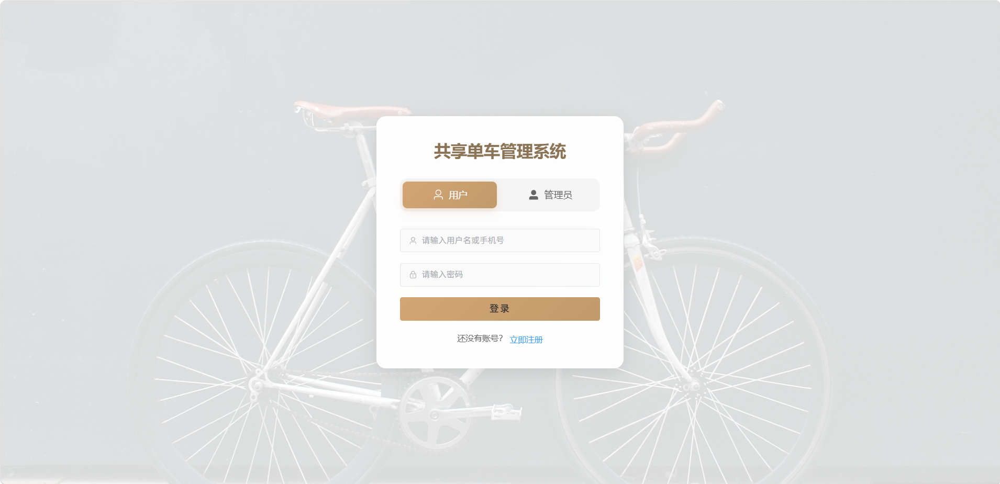
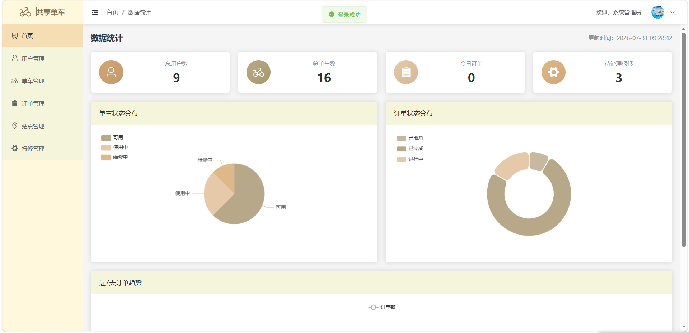
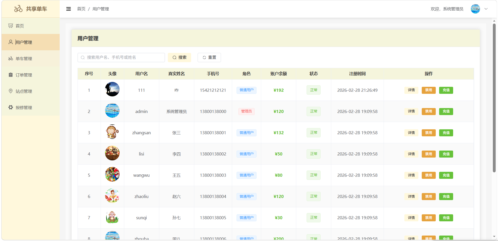
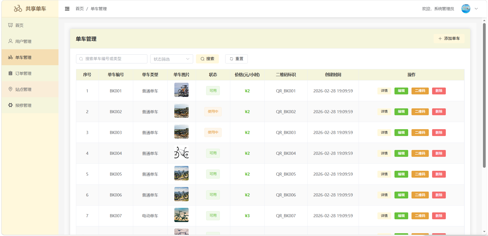
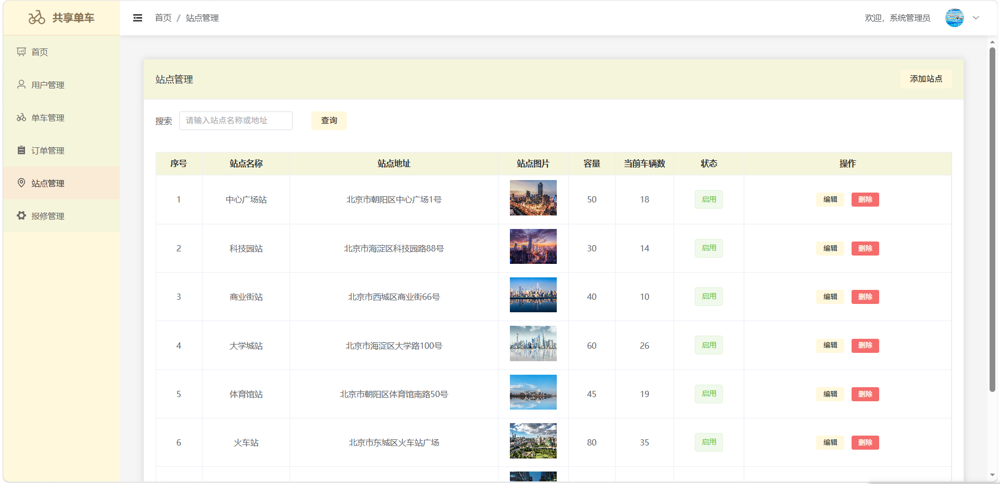
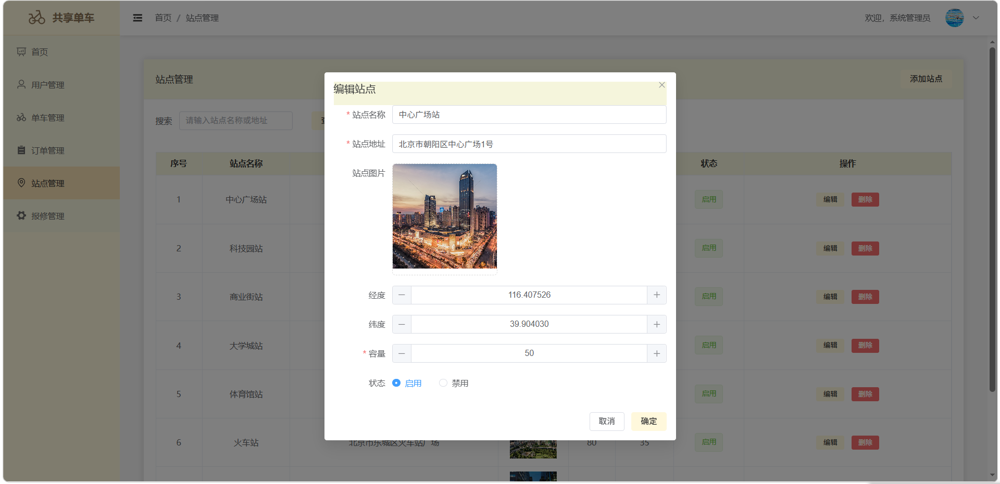
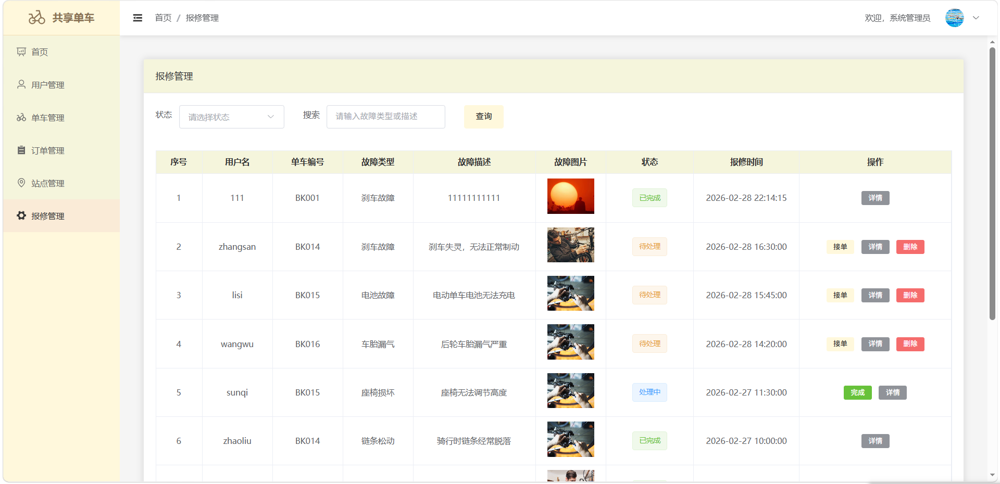
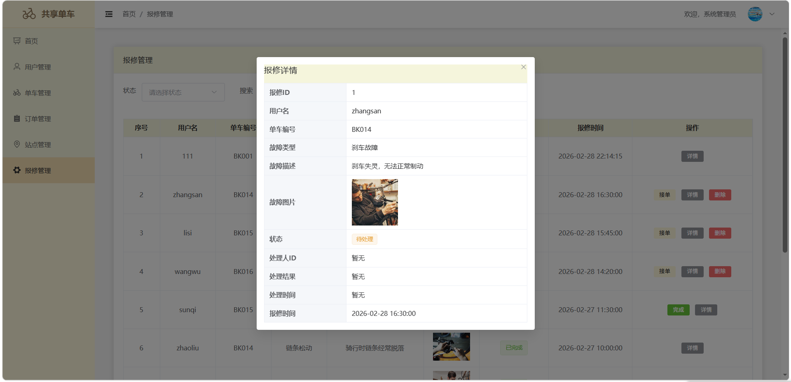
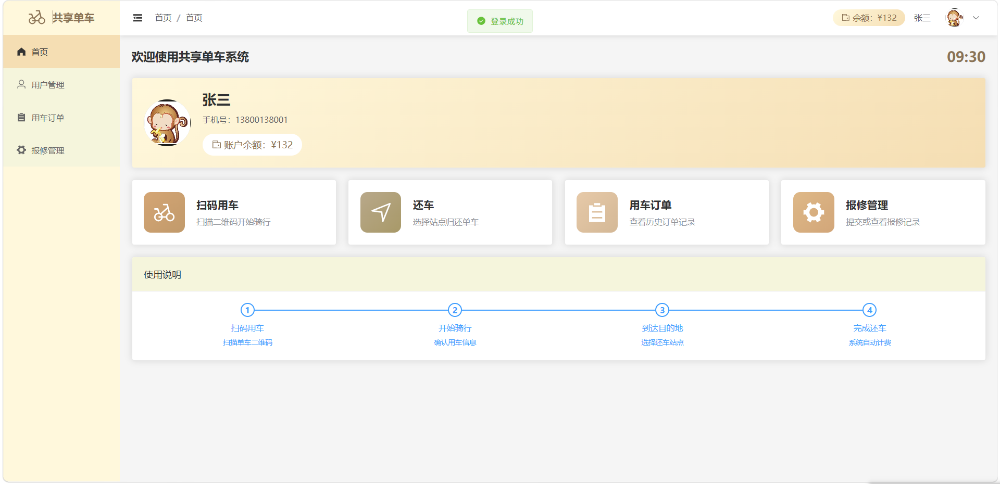
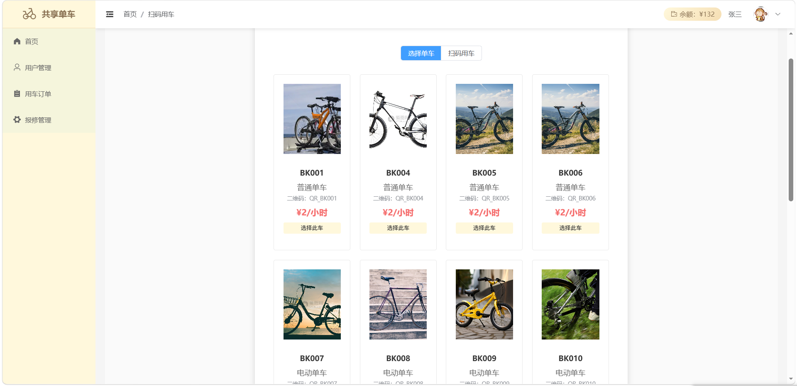
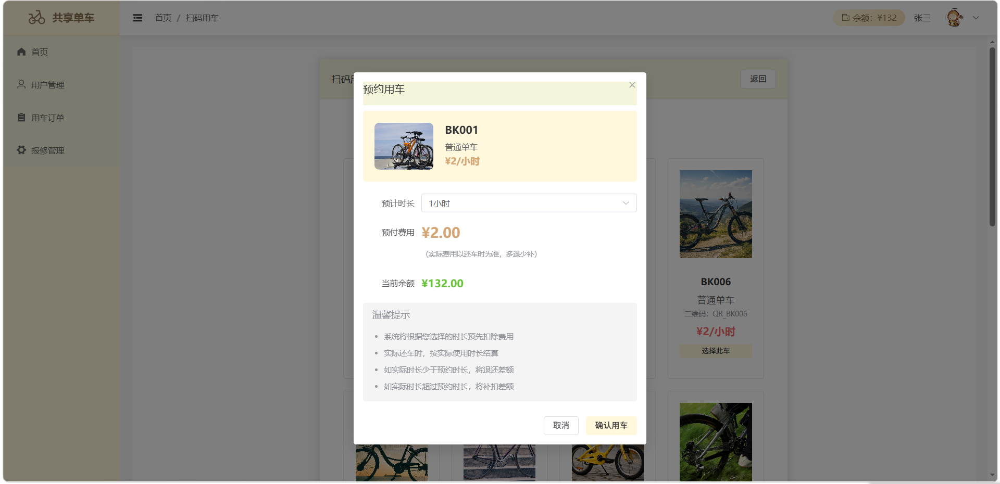
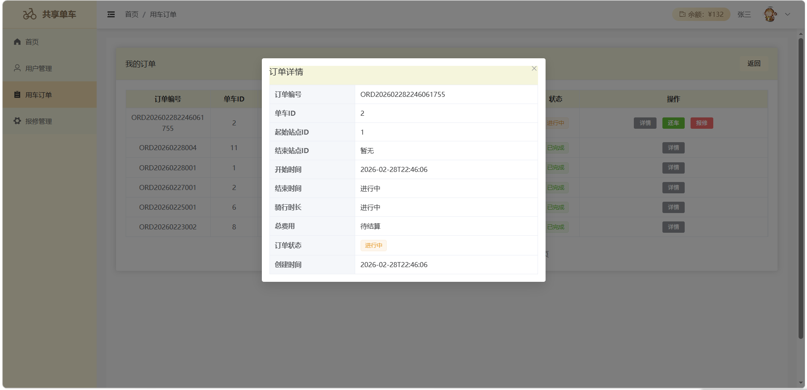

#### 常见问题

1、数据库连接失败：检查 MySQL 是否启动，确认 `application.yml` 中数据库名、账号、密码是否正确。

2、SQL 导入后没有表：请确认 `init.sql` 已真正导入 `bike_sharing` 数据库，而不是仅创建了空库。

3、前端构建失败：请检查 Node.js 版本，建议使用 `Node.js 18` 或 `Node.js 20`，避免过高版本导致依赖兼容问题。

4、后端启动成功但公网无法访问：请检查云服务器安全组、防火墙和 Nginx 反向代理配置。

5、图片上传或显示失败：请检查后端 `upload` 目录是否存在，是否具有读写权限，以及数据库中的图片路径是否正确。

6、前端接口请求失败：请确认后端服务已在 `8080` 端口启动，并检查 `vite.config.js` 中 `/api` 代理配置是否正确。
